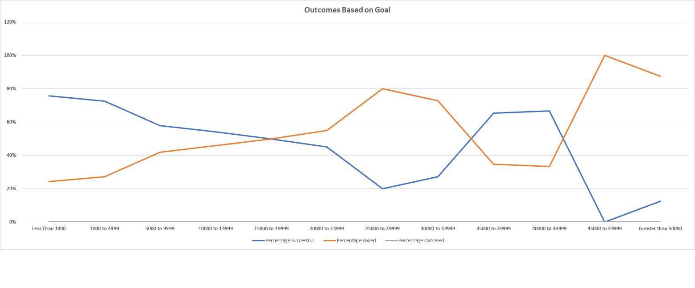

# Kickstarting with Excel

## Overview of Project

Louise, an up and coming playwriter, just completed her first crowd funding campaign for her play Fever. The campaign came close to its fundraising goal. Reflecting on the campaign, Louise wants to know how different campaigns fared in relation to their launch dates and their funding goals. This knowledge will be valuable for Louise for future crowd funding campaigns. 

### Purpose

She has asked me to analyze crowd funding data to gain a greater understanding of specific factors that make a project campaign successful. I looked specifically at how launch dates and funding goals affect the success and outcome of campaigns. Using pivot tables and graphing in Excel, I analyzed campaign outcomes (successful, failed, and canceled) based on launch date. 

## Analysis and Challenges
To analyze the crowd funding data, I looked at campaign outcomes based on (1) launch date and (2) funding goal amounts.  

### Analysis of Outcomes Based on Launch Date
Methodology of how I analyzed outcomes based on launch date: 
1.	I created a “Years” column using the YEAR() function in excel to extract the year from the “Date Created Conversion” column. 
2.	Next, I created a pivot table based on “Parent Category” and “Years” in the filter. I placed “outcomes” in the legend, “Date Created Conversion” in axis, and “country” in values. 
3.	I filtered the columns to only show “successful”, “failed”, and “canceled”. 
4.	Next, I filtered the “Parent Category” to only show data for “theater” since Louise is interested in the success of plays. 
5.	I sorted the campaign outcomes in descending order so “successful is first. 
6.	Lastly, I created a line chart to visualize the relationship between outcomes and launch month. 

Please see the tab “Theater Outcomes by Launch Date” in the following spreadsheet for the pivot table created. [Kickstarter_Challenge.xlsx](Kickstarter_Challenge.xlsx).

### Analysis of Outcomes Based on Goals
Methodology of how I analyzed outcomes based on funding goal amounts: 
1.	In a new sheet called “Outcomes Based on Goals”, I created a “Goal” column based on dollar-amount ranges so projects can be grouped based on their goal amount. 
2.	I then used the COUNTIFS() function in excel to populate the columns “Number Successful”, Number Failed”, and “Number Canceled”. I filtered on the Kickstarter “outcome” column and by the “goal” amount column using to populate the count in the correct goal range. Lastly, I also filtered on the “Subcategory” column using “plays” as the criteria since Louise is mainly interesting in play campaigns. 
3.	Next, I used the SUM() function in excel to population the “Total Projects” column with the number of successful, failed, and canceled projects for each row. 
4.	I was then able to calculation the percentage of successful, failed, and canceled projects for each row. 
5.	Lastly, I created a line chart to visualize the relationship between the goal-amount ranges on the x-axis and the percentage of successful, failed, or canceled projects on the y-axis. 

Please see the tab “Outcomes Based on Goals” in the following spreadsheet for the goals analysis. [Kickstarter_Challenge.xlsx](Kickstarter_Challenge.xlsx).

### Challenges and Difficulties Encountered
I had minimal challenges while completing the analysis. However, possible difficulties that could be encountered is created the pivot table for the analysis on launch date and placing the right columns in the correct areas. In order to get only months, I had to make sure the only column placed in axis was the “Date Created Conversion”. I also had to experiments with changing the line and markers colors on the graph. The best way I overcame these challenged was just testing things out until I understood what each field in the pivot table represented. A possible challenged for the analysis on goals could be creating the correct code for the COUNTIFS() and making sure the equations were corresponding to the goal ranges. A solution to this challenge might be to manually check one goal range to better understand what the code is doing and to quality check that code is doing what you want it to. 

## Results
- What are two conclusions you can draw about the Outcomes based on Launch Date?

There are two conclusions we can draw about the outcomes of a crowd funding campaign based on launch date. 
1.	We see a higher number of successful campaigns with a launch date the summer. A launch date in May has the largest number of successful campaigns. The number of successful campaigns declines at a constant rate till September with a slight increase in October but then another decline in successful campaigns until the end of the year. 
2.	Failed campaigns are relatively constant at around 40-50 failed campaigns throughout the year. There are fewer failed campaigns with launch dates in the beginning of the year, September, November, and December but that might be because there are fewer campaigns overall around those times. 
3.	Canceled campaigns is constant throughout the year with less than ten.

- What can you conclude about the Outcomes based on Goals?

A main conclusion about outcomes based on funding goal amounts is that percentage of successful and failed campaigns are completely inverse. When the funding goal amount is less than $50,000, there is a much higher percentage of successful campaigns then failed campaigns. However, when the funding goal amount is between $250,000 and $300,000, there is a higher failed percentage than successful percentage. According to the chart, the funding goal amount ranges were we see the highest percentage of successful campaigns are between $150,000 or less and $350,000 to $450,000. 

- What are some limitations of this dataset?
A limitation to the dataset could be if the data provided came from surveys, that the information may not be completely accurate or updated. Also, if the data collected is from different sources based on country, the quality and format might differ. Lastly the data could be incomplete.  

- What are some other possible tables and/or graphs that we could create?
Other possible tables we could create to help us gain a better understanding of what factors impact a campaign are: 
1.	Looking at outcomes based on backers count and test if a higher number of backers impact the outcome of a crowd funding campaign. 
2.	Analyzing the time length of a campaign and see if longer campaigns have a higher successful rate.  

